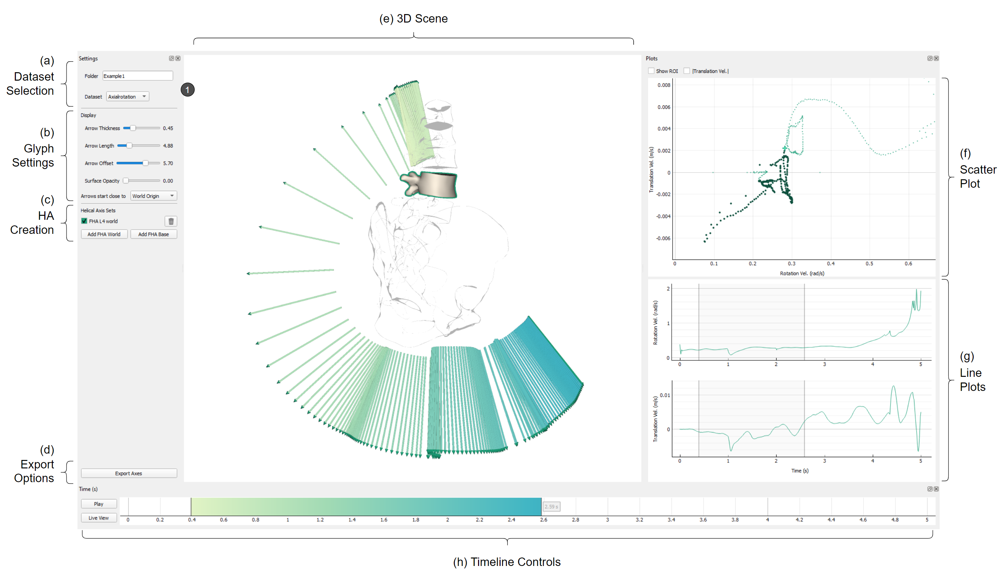
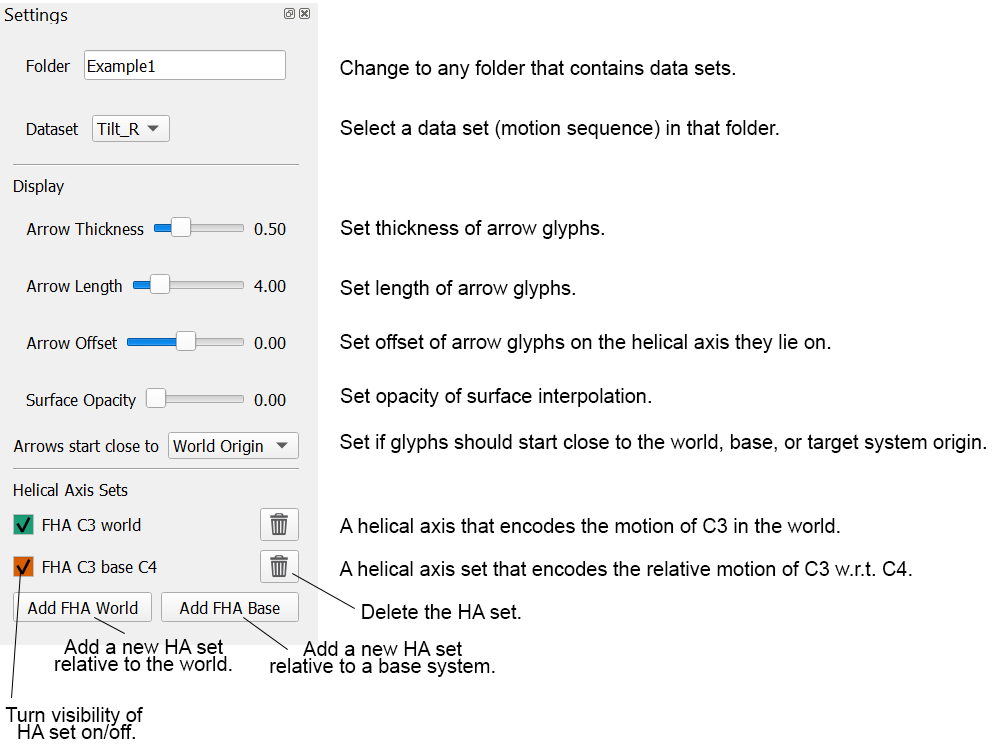
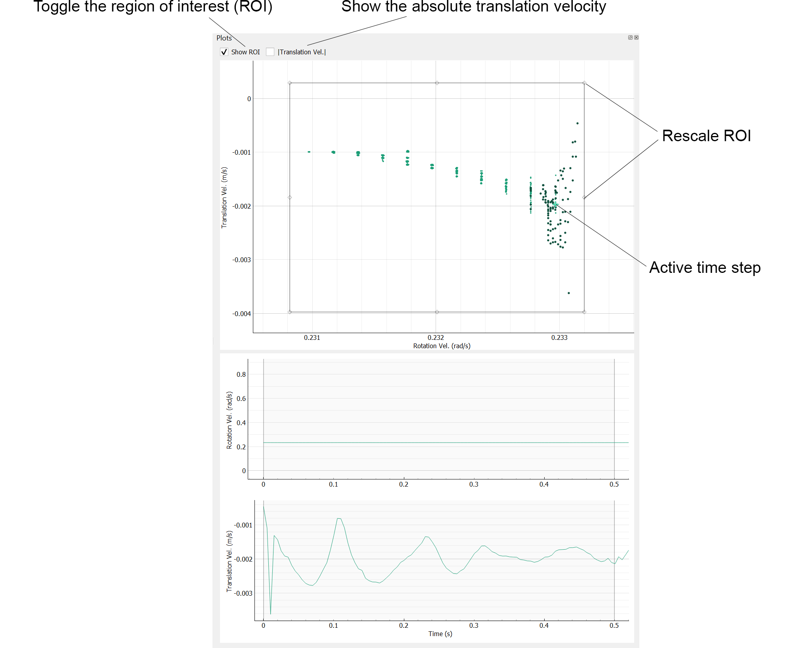

# HAExplorer



The HAExplorer is a tool for the creation, visualization, filtering, and exploration of finite helical axes for biomechanical modeling. It takes as input an arbitrary number of objects (.obj) and their respective motions (rotations+translations or marker positions). When using or building on this work, please cite:

Pepe Eulzer, Robert Rockenfeller, and Kai Lawonn. 2022. HAExplorer: Understanding Interdependent Biomechanical Motions with Interactive Helical Axes. In <i>CHI Conference on Human Factors in Computing Systems</i> (<i>CHI '22</i>). ACM, New York, NY, USA, Article 26, 1–16. https://doi.org/10.1145/3491102.3501841

There is also a [video introduction](https://youtu.be/rpscgmlUSWM) of the tool.

It is maintained by the [Visualization and Explorative Data Analysis Group, University of Jena](http://vis.uni-jena.de/).

Contact: pepe.eulzer[at]uni-jena.de


## How to Run

### Run Standalone (Windows)

You can use the standalone .exe to explore the examples or load your own data.

- You do not need to install anything.
- You do not need the source files in `/src`.

*Note that the initial execution may take 5-30 seconds depending on your system.*


### Run from Source (any OS)

**Direct Dependencies**

 - Python 3.9

 - [PyQt5 5.12.3](https://pypi.org/project/PyQt5/): cross-platform UI, window manager, event handler (and CPU-side matrix computations)

 - [pyqtgraph 0.12](http://www.pyqtgraph.org/): Qt-based plotting tools

 - [PyOpenGL 3.1.5](https://pypi.org/project/PyOpenGL/): wrapper of OpenGL
   *Your system needs to fully support OpenGL 4.0 or greater.*

 - [igl 2.2.1](https://libigl.github.io/libigl-python-bindings/): mesh loading and processing

   

**Setup**

These instructions use the [Anaconda Prompt](https://www.anaconda.com/products/individual).

Create a Python environment and install the proper version of pyqtgraph. Add the other packages (let conda solve the versions):
```
conda create --name HAenv -c conda-forge pyqtgraph=0.12 pyqt igl pyopengl
```

To run, use:
```
conda activate HAenv
cd <your path>/haexplorer
python src/HAExplorer.py
```
> The prompt needs to run from the top-level directory for the examples to load.


### Use your own Files

Once running, you can specify a folder with your own X.obj geometries and motion files (X_rot.txt, X_pos.txt per geometry). See the examples to understand how the files need to look like. They are all text-based lists of the rotation (matrix) and translation (vector) per timestep. A set of objects can be paired with different motions for comparison. The names of the .obj and _pos.txt, _rot.txt need to match. Use a folder structure as follows:

```
dataset
 |-settings.txt
 |-geometry1.obj
 |-geometry2.obj
 |-...
 |-motion1
    |-geometry1_pos.txt
    |-geometry1_rot.txt
    |-geometry2_pos.txt
    |-geometry2_rot.txt
    |-...
 |-motion2
    |-...
 
```

Instead of the rotation/translation convention, you can also input a list of $\geq 3$ markers per geometry that will be automatically converted. See `Example2` for examples of such marker files. The first line in a marker file describes the marker positions in the object coordinate space of the .obj file. The remaining lines are time steps in world space coordinates.

```
dataset
 |-geometry1.obj
 |-geometry2.obj
 |-motion
    |-geometry1_marker.txt
    |-geometry2_marker.txt
```

> The marker files will be automatically converted to _pos.txt and _rot.txt files when the motion is first loaded.

**Settings**

You can adjust the following startup settings by providing a `settings.txt` file in the dataset folder:

- `time_start` where the timeline should start (seconds, float).
- `time_end` where the timeline should end (seconds, float).
- `models_scale` a default scale factor for the .obj models (float).
- `glyphs_scale` a default initial scale factor for the arrow glyphs (float).
- `outline_width` a scale factor for the outlines created around objects (float).

See the examples for how the file needs to look like. Default values will be used if left unspecified.


## Functionality Overview

### Navigation

3D scene
* Rotate scene: left click
* Translate scene: middle click
* Zoom: Scroll

Plots
* Pan/Translate: left or middle click
* Zoom: Scroll
* Rescale axes: right click


### Control Pane




### Creating Axis Sets

At startup the scene will not contain any HA sets. 

- Select `Add FHA World` to create an HA set that encodes motion in the world. Next, select any object in the scene for which this set should be created. The button needs to be pressed for every object.
- Select `Add FHA Base` to create an HA set that encodes motion relative to a (moving) base object. The base can be any object in the scene. First select the base - it will be highlighted - then select the target object.

World and Base HA sets can be mixed in one scene.


### Plots


